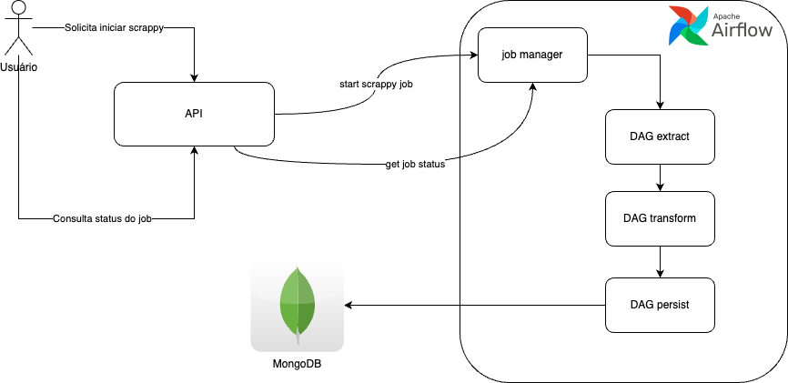

# Projeto extrator de dados

## Visão geral

O objetivo deste projeto é criar uma api capaz de extrair e armazenar dados provindos do site da embrapa, em particular 
do site com dados de [vitivinicultura](http://vitibrasil.cnpuv.embrapa.br/index.php?opcao=opt_01).

A arquitetura dessa solução irá consistir de:

* Api para gerenciar chamadas
* Airflow para gerenciar os job's, tasks e agendamentos
* MongoDB para armazenar os dados.

Abaixo um diagrama dessa arquitetura.

## Casos de uso

O usuário terá basicamente 3 casos de uso:

### Iniciar job de scrappy

Esta primeira api deverá iniciar um job para baixar os dados, e deverá receber como parâmetro um range de anos; Parâmetros `yearStart` e `yearEnd`.

Com esses parâmetros iremos submeter o job no airflow, e deveremos retornar o status do job, se foi submetido com sucesso, e o id do job para posterior consulta.

### Consultar status do job de scrappy

Esta api deverá receber como path param o `jobId` do airflow; Deverá consultar o status deste job no airflow e retornar para o usuário.

### Extração de dados

A extração de dados consiste em 3 etapas:

* Extração 
* Transformação
* Persistência

Cada etapa será uma DAG construída no airflow.

## Diagramas de sequência

### Iniciar job de scrappy 

---

### Consultar status do job

### Extração de dados

